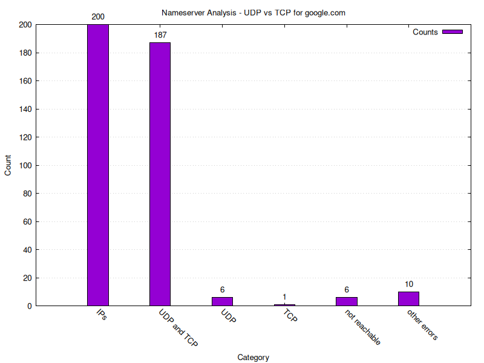
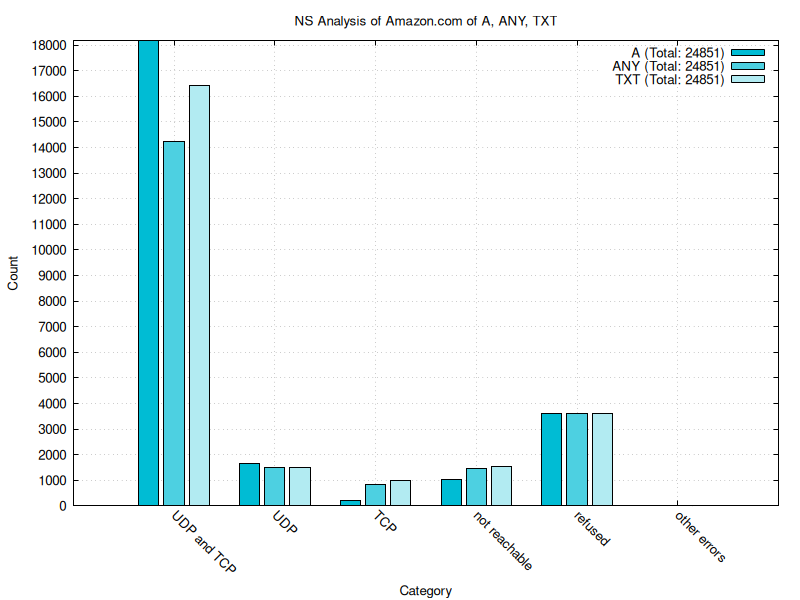
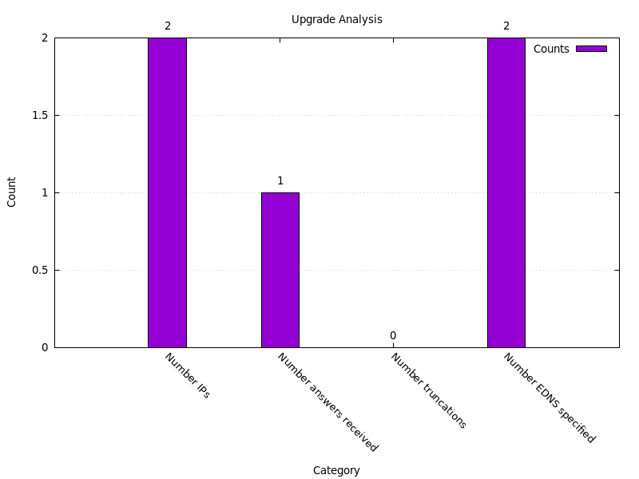

# UCONN CSE 4402 Project - DNS TCP vs UDP

Analyze the usage of TCP vs UDP for DNS queries. 


## Requirements

- `dig`
- `gnuplot`


## Running

Note that for each new run, the cleanup (described below) is important!
Otherwise, the new results will be added to the old results.


```bash
./dig_script ips.txt
./dig_analysis analysis.png
./dig_udp_script
```


We provided also a `./run` file, which coordinates the main steps in a proper
way. You may run the script the following way. **Note** that for this to work
we expect a `./data/` directory with a `ips.txt` file containing the IPs of
nameservers to be analyzed. The script will create additional files needed to
process the given `ips.txt` file in the same directory and at the end a image
`{record}_analysis.png` is saved (in the same directory).

```bash
./run --domain amazon.com --dir ./data_amazon/
```

In this example call, we expect a file called `ips.txt` in the directory
`./data_amazon/`.


## Advanced Run Options

- `./dig_script ips.txt -P 12`: If your `ips.txt` is really long, you can take
  advantage of the parallel implementation by passing with `-P` how many
  processes should run in parallel.
- `./dig_script ips.txt --domain nohello.net`: If you want to `dig` for another
  domain than the default `google.com`.


Note that in the `./dig_analysis` the `--data` should always be the same as the
positional argument of `./dig_script`. Additionally, all other optional
parameters should match for obvious reasons.


## Results

The ultimate end goal is the following plot, where one can see the number of
IPs analyzed. They are futher broken down into "UDP and TCP", "UDP only", and
"TCP only". Also interesting to see how many nameservers were not reachable,
and if there were any other errors.




If the plot should be a comparison between three different resource record
results, the following command can be used. Note that obviously the 3
`./results/Amazon_*.txt` need to be of the same format.

```bash
gnuplot -persist -c "plot_comparison.gp" "./result/example_analysis_comparison.png" \
  "NS Analysis of Amazon.com of A, ANY, TXT" \
  "./results/Amazon_A.txt" "A" \
  "./results/Amazon_ANY.txt" "ANY" \
  "./results/Amazon_TXT.txt" "TXT"
```




The second plot that is generated (upgrade.png) displays the amount of IPs that
have been deemed as "UDP only" before, broken down into the number of IPs that
returned the whole amazon.com TXT resource record (exceeds 3000 byte in size),
that set the TC (truncated) flag and that returned information about their supported
EDNS(0) buffer size.



## Cleanup

Delete all `dig_script` related output files with the following command.


```bash
rm -v dig_*.txt
``` 


## Results 

Results are discussed in the readme in the `./results` directory:
[./results/README.md](./results/README.md).

