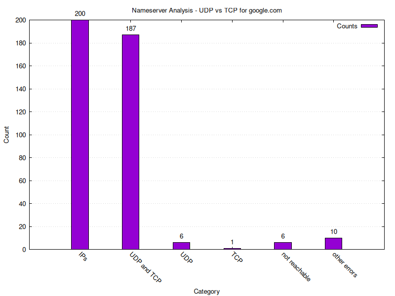

# UCONN CSE 4402 Project - DNS TCP vs UDP

Analyze the usage of TCP vs UDP for DNS queries. 


## Requirements

- `dig`
- `gnuplot`


## Running

```bash
./dig_script ips.txt
./dig_analysis analysis.png
```


## Advanced Run Options

- `./dig_script ips.txt -P 12`: If your `ips.txt` is really long, you can take
  advantage of the parallel implementation by passing with `-P` how many
  processes should run in parallel.
- `./dig_script ips.txt --domain nohello.net`: If you want to `dig` for another
  domain than the default `google.com`.


Note that in the `./dig_analysis` the `--data` should always be the same as the
positional argument of `./dig_script`. Additionally, all other optional
parameters should match for obvious reasons.


## Results

The ultimate end goal is the following plot, where one can see the number of
IPs analyzed. They are futher broken down into "UDP and TCP", "UDP only", and
"TCP only". Also interesting to see how many nameservers were not reachable,
and if there were any other errors.





## Cleanup

Delete all `dig_script` related output files with the following command.


```bash
rm -v dig_*.txt
``` 


