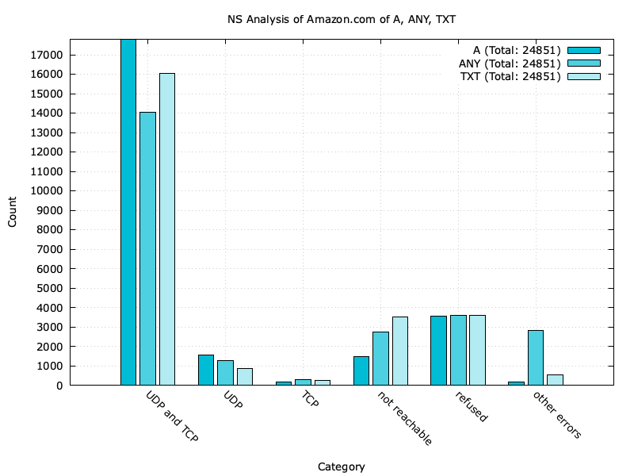

# UCONN CSE 4402 Project - DNS TCP vs UDP

Analyze the usage of TCP vs UDP for DNS queries. 


## Requirements

- `dig`
- `gnuplot`


## Running

Note that for each new run, the cleanup (described below) is important!
Otherwise, the new results will be added to the old results.


```bash
./dig_script ips.txt
./dig_analysis analysis.png
./translate_domains <file>
./dig_udp_script
```


We provided also a `./run` file, which coordinates the main steps in a proper
way. You may run the script the following way. **Note** that for this to work
we expect a `./data/` directory with a `ips.txt` file containing the IPs of
nameservers to be analyzed. The script will create additional files needed to
process the given `ips.txt` file in the same directory and at the end a image
`{record}_analysis.png` is saved (in the same directory).

```bash
./run --domain amazon.com --dir ./data_amazon/
```

In this example call, we expect a file called `ips.txt` in the directory
`./data_amazon/`.

In order to test authoritative nameservers, we provide a script `translate_domains`,
that takes as argument one filename that lies in the `domains`-directory. On each line,
the file should contain a domain-name and possible other information that must be
separated from the domain-name by a comma. The script then looks up authoritative-
nameservers for the respective domains using the cloudflare-resolver at
ip-v4 address `1.1.1.1`. It takes the first nameserver in the response and makes
a second DNS-query looking for the A-record of the respective nameserver.
It then creates a CSV-style file, on each row the ip-address from the authoritative
nameserver and, separated by a comma, the domain-name.

The script `dig_udp_script` takes a file (`dig_udp_only` by default, can be specified
with `--input-file <file>`) as input, which should be in CSV-style, located in the
`data`-directory and on each row should contain at least the ip of a nameserver /
resolver, which may be followed by a domain-name.
The script makes four DNS lookups for each ip, looking up ANY and TXT records and
differentiating between using EDNS(0) or not. The domain-name for the query is either
the domain-name specified in the input-file, or `amazon.com`, if not specified.
The script creates several output-files, including four graphs for each type of query
in the `amplification`-directory.


## Advanced Run Options

- `./dig_script ips.txt -P 12`: If your `ips.txt` is really long, you can take
  advantage of the parallel implementation by passing with `-P` how many
  processes should run in parallel.
- `./dig_script ips.txt --domain nohello.net`: If you want to `dig` for another
  domain than the default `google.com`.
- `./dig_udp_script --input-file <input_file> --output_file <output_file> --image-name <image_name>`:
  Specifies the input-file, the suffix of output-files and the suffix of the graphs created.


Note that in the `./dig_analysis` the `--data` should always be the same as the
positional argument of `./dig_script`. Additionally, all other optional
parameters should match for obvious reasons.


## Results

The ultimate end goal is the following plot, where one can see the number of
IPs analyzed. They are futher broken down into "UDP and TCP", "UDP only", and
"TCP only". Also interesting to see how many nameservers were not reachable,
and if there were any other errors.


If the plot should be a comparison between three different resource record
results, the following command can be used. Note that obviously the 3
`./results/Amazon_*.txt` need to be of the same format.

```bash
gnuplot -persist -c "plot_comparison.gp" "./result/example_analysis_comparison.png" \
  "NS Analysis of Amazon.com of A, ANY, TXT" \
  "./results/Amazon_A.txt" "A" \
  "./results/Amazon_ANY.txt" "ANY" \
  "./results/Amazon_TXT.txt" "TXT"
```




The four plots that are generated by `dig_udp_upgrade` break down each type of query
in different categories, the number of queries that resulted in a non-null answer,
truncation-flag set, support of EDNS(0), maximum UDP-size using EDNS(0), number
of answers received, message-size > 3000 bytes, message-size > 512 bytes, number of errors,
number of successful UDP-queries.


## Cleanup

Delete all `dig_script` related output files with the following command.


```bash
rm -v dig_*.txt
``` 


## Results 

Results are discussed in the readme in the `./results` directory:
[./results/README.md](./results/README.md).

