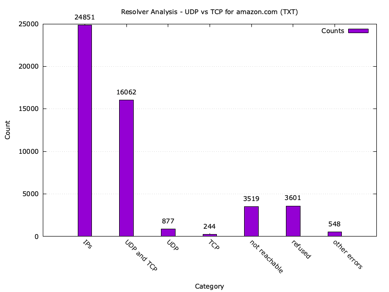

# Results

In this readme, we discuss and interpet the results of the runned scripts. 

Note that we did not include all the files. We especially did not include the
intermediary .txt files, because they are not relevant for the results.

## Input IP File

As for the list of nameservers, we took the list of reliable DNS resolvers from
[trickest GitHub
Repo](https://github.com/trickest/resolvers/blob/main/resolvers.txt) and saved
it as `./data/ips.txt`.

## Both, TCP only, and UDP only Analysis 

The following plot shows the distribution of successful UDP and TCP requests
(as 'Both'), only successful UDP request (UDP only), and only successful TCP
requests (TCP only). The request is made for `amazon.com A ?`, first as a
normal `dig` call, then with `+notcp` and `+tcp` respectively to determine if
TCP or UDP only.

Most nameservers support both UDP and TCP. There are more nameservers for UDP
only than TCP only. It is good to see that the DNS Rfc is implemented correctly
for most nameservers (to support both UDP and TCP). However, relative to that,
there is still a mentionable number of nameservers which do not implement the
Rfc correctly, either by supporting only UDP or TCP. Nevertheless, this number
might fluctuate a bit due to unreliability (packages getting dropped or
ignored).

About 4500 nameservers are not reachable, refuse the connection, or throw
another error. This is an acceptable ratio, since we have a majority that is
actually successful in answering our request in order to allow a good analysis.

The following two plots show the same experiment, but for `ANY` and `TXT`
records. We did this check to, to see if there is a difference in the handling
of the request, when requesting resource records of potentially larger response
size.

We can observe that the number of nameservers that are not reachable has
increased. The number of TCP only nameservers has also increased, while the
number of UDP and TCP has decreased. This was to expect, due to the definition
in the Rfc that states that when the response size becomes too large, the
protocol to be used should no longer be UDP, but TCP.

## Upgrade from UDP to TCP on Large Response 

todo 

